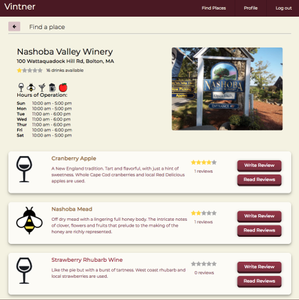

# Vintner #

This is a [Thinkful](https://www.thinkful.com) end of course portfolio project for React web development. This is the front end repository for the Vintner app. To view the back end repository [click here](https://github.com/LarissaMorrell/vintner-server). Visit the live app at (http://vintner.netlify.com).

### What is it? ###
Vintner was designed to help the average person select the best adult beverage available. Users are able to read and write reviews of drinks from local breweries, wineries, cideries, meaderies, and distilleries.

### Background ###
One of my favorite hobbies is going to various places throughout New England and purchasing a flight or a tasting. But I always run into the same frustration: how do I choose 5 to taste out of 30+ options? When revisiting places, I would also lose track of what I had already tried. Wouldn't it be great if there was and app that can help me make better drink selections and keep track of the drinks I've already tried? That's when I started to build this app.

### Use Case ###
Why is this app useful? This app helps the average adult beverage enthusiast select drinks he/she is most likely to enjoy. Know that you don't like beers that are hoppy? Do you prefer wines which are sweeter? Use Vintner to see what others have already said about the drinks you are considering.

Don't waste time on rating menus that just end up lost or forgotten. Users are able to keep track of the places they've previously visited and drinks they have already tried by leaving ratings and reviews. All of this is easily viewed in each user's profile, so viewing the drinks they've already tried is just one click away.

### Technical ###
This app was built with HTML5, CSS3, JavaScript, React.js, and Redux. The repository for the front end of this app is available [here](https://github.com/LarissaMorrell/vintner).
* Passport - Managing form state in Redux (https://redux-form.com)

### Functionality ###
* Users search local companies for ratings and drink types available.

* Users view a company to see an overview and a listing of drinks with descriptions and users' ratings.

* Users read reviews and ratings of a drink written by other users.

### Development Roadmap ###
This is v1.0 of the app, but future updates and enhancements are expected to include:
* Users will be able to delete and edit reviews they've already written
* Users will have the ability to add their own companies and stores
* View of stores will also include a map-view of company locations
* Ability of linking to "friends" and viewing friends' profiles

### Contact information ###
* Author: Larissa Morrell
* Email: larissa.perkins@gmail.com
* GitHub: https://github.com/LarissaMorrell
* LinkedIn: https://www.linkedin.com/in/larissamorrell
